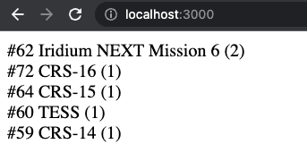

# React & Rockets

**Description:** Challenge for Adjust Frontend Developer

**Owner:** [adjust](https://github.com/adjust)

**Contacts:** frontend-hiring@adjust.com

---

## Welcome to our little coding exercise! 👋

Here you will be given the opportunity to play with JavaScript and Rockets in the same project. For this, we recommend you to block 2-3 hours of your time to complete it.

**Please make sure you have read this page entirely, before starting the challenge**. If you have any doubts, please reach out to us by [opening an issue](#how-to-request-help) as described at the bottom of this page.

**Importantly**, we would like to give all candidates taking this test the same opportunity to solve the exercise in their own way. Because of this, **please do not fork or share this repo (nor your solution) with anybody 🙏🏻**


## Instructions

1. Push your solution to a **private repo** in your **personal Github account**
2. When you are ready for us to take a look, please add [adjust-frontend-hiring][adjust-frontend-hiring] (GitHub user) as collaborator

## General notes

- The final solution must be a working React application.
  - It's up to you how to bootstrap a new React application.
- You can use any third-party library if you see a good fit for it.
- It's not necessary to heavily comment the code, please only leave comments where they are necessary for code comprehension. However, we welcome notes and comments that reflect the higher-level decisions made during the challenge.
- Aspects to be assessed:
  - Code Style – meaningful naming conventions, consistent code formatting, and emphasis on code readability and future extensibility.
  - Quality Assurance – the solution you upload should work as expected, conforming to the specifications of the tasks.
  - Introducing best practices such as tests, type safety, and linting is appreciated.

Good luck and happy coding! 🚀

---

## Exercise

### TASK #1 - JavaScript

Implement `prepareData` higher order function, which takes an object of filter params `{year, customerName}`, and returns a function that processes a list of missions, by only showing the ones that were launched in `year` and carried a payload belonging to `customerName`.

**Observations:**

- Missions should appear in inverse chronological order (sorted by the
  `launch_date_utc` field), with the exception that those carrying more payloads should appear first.
- Payloads are carried in the second stage of a rocket and they can belong to multiple customers.
- It doesn't matter to which `customerName` 'program' each payload belongs to as long as `customerName` is the customer.

**Example:**

Considering we have a response from the [SpaceX API](spacex-api) and the following filter params:

```js
{
  year: 2018,
  customerName: "NASA"
}
```

The expected result should be:

```js
[
  {
    flight_number: 62,
    mission_name: "Iridium NEXT Mission 6",
    payloads_count: 2,
  },
  {
    flight_number: 72,
    mission_name: "CRS-16",
    payloads_count: 1,
  },
  {
    flight_number: 64,
    mission_name: "CRS-15",
    payloads_count: 1,
  },
  {
    flight_number: 60,
    mission_name: "TESS",
    payloads_count: 1,
  },
  {
    flight_number: 59,
    mission_name: "CRS-14",
    payloads_count: 1,
  },
];
```

---

### TASK #2 - React & Hooks

Implement `<RocketsList>` component with the following specifications:

- The component receives `filerParams` object (with the shape described in [task #1][task-1]) as a prop.
- The component obtains a list of 'missions' from a [custom hook][custom-hook], which fetches **the whole list of missions** from the [SpaceX API][spacex-api] and processes them with `prepareData` function (from [task #1][task-1]) and `filterParams` prop.
  - The mission data should only be fetched once.
  - As a part of this challenge, you are not allowed to use any of the filter parameters provided by the [SpaceX API docs][spacex-api-docs].
- For each 'mission' obtained from the custom hook, the component renders a string using [template literals][template-literals] with the following format: "#`flight_number` `mission_name` (`payloads_count`)"
- While 'missions' are being fetched from the API, the component renders `"Loading..."` on the screen.
- If no 'missions' are obtained from the custom hook, the component renders `"No data"` on the screen.

**Example:**

Considering we render `RocketList` like the following:

```js
<RocketList
  filterParams={{
    year: 2018,
    customerName: "NASA",
  }}
/>
```

The expected render should be similar to the following:



We will be testing your solution with a small set of E2E tests, please make sure your solution conforms to the specifications above. Our E2E tests rely on the following facts:

- Your React application starts a development server by running `npm run start` command.
- The development server is hosted on `localhost:3000`.
- The markup is represented as an unordered list, composed with `<ul>` and `<li>` HTML elements, please refer to an example below:

```html
<ul>
  <li>#62 Iridium NEXT Mission 6 (2)</li>
  <li>#72 CRS-16 (1)</li>
  ...
</ul>
```

## How to request help

If you have any doubts, you can reach out to us by simply [creating a GitHub issue](https://docs.github.com/en/issues/tracking-your-work-with-issues/creating-an-issue#creating-an-issue-from-a-repository) in your private repo.

Describe your question(s) and [mention](https://docs.github.com/en/github/writing-on-github/getting-started-with-writing-and-formatting-on-github/basic-writing-and-formatting-syntax#mentioning-people-and-teams) [adjust-frontend-hiring][adjust-frontend-hiring] in your comments (don't forget to add user as collaborator). We will then receive a notification and get back to you as soon as possible.

## Helpful links

- [SpaceX API Docs][spacex-api-docs]
- [Inviting collaborators to a personal repository][github-collaborators]

[spacex-api]: https://api.spacexdata.com/v3/launches/past
[spacex-api-docs]: https://docs.spacexdata.com/?version=latest#fce450d6-e064-499a-b88d-34cc22991bcc
[github-collaborators]: https://help.github.com/en/articles/inviting-collaborators-to-a-personal-repository
[task-1]: #task-1---javascript
[template-literals]: https://developer.mozilla.org/en-US/docs/Web/JavaScript/Reference/Template_literals
[custom-hook]: https://reactjs.org/docs/hooks-custom.html
[adjust-frontend-hiring]: https://github.com/adjust-frontend-hiring
